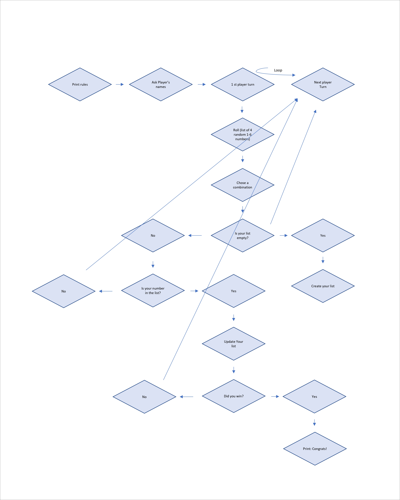
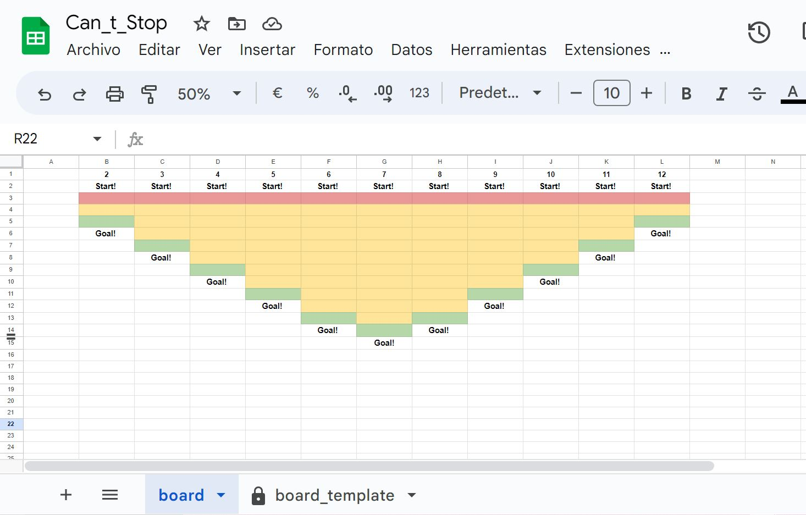

# Simplified Can't Stop Game

This project is a simplified version of the dice game "Can't Stop". It is designed for players who enjoy strategic and competitive games. The objective is to reach the goal number in three columns before the opponent(s).

## Design of the Workflow

The logic workflow of the game experienced several challenges during the coding process. Initially, I attempted to code the entire game, but soon realized that it was too complex for the given time frame. As a result, I created a simplified version of the workflow. However, after some work, it became apparent that the game, adhering to best practices that advise against asking the player for information the game already has, would play automatically after the first turn, without requiring further input from the player.
The original workflow was a recreation of the full game in all logical steps I could find. Unfortunately, I overwrote this file with the new workflow.
The new workflow was designed as follows:

Ultimately, our game landed somewhere in between the original and the new workflow designs, offering a balanced and engaging gameplay experience for the players. 

## Rules

Please find the complete rules of the original game [here](https://www.ultraboardgames.com/cant-stop/game-rules.php). The rules of my simplified version are:

### Number of Players

The game is set up to allow 2 players only. Players will be prompted to enter their names.

### Objective

The goal of the game is to advance to the uppermost square in a column. Players choose the number they want to play with during their first successful roll, and from then on, they will move one square every time this number shows as a valid combination of their roll.

# Simplified Can't Stop Game

## Table of Contents
- [Introduction](#introduction)
- [Prerequisites](#prerequisites)
- [Installation and Setup](#installation-and-setup)
- [Design of the Workflow](#design-of-the-workflow)
- [Game Rules](#game-rules)
- [Usage](#usage)
- [Screenshots](#screenshots)
- [Testing](#testing)
- [Deployment](#deployment)
- [Credits](#credits)
- [License](#license)
- [Conclusion](#conclusion)

## Introduction
This project is a simplified version of the dice game "Can't Stop," designed for strategy game enthusiasts. The objective is to reach the goal number in three columns before the opponent(s).

## Prerequisites
- Python 3.x
- Heroku Account
- Google Sheets API access

## Installation and Setup
You need to open your Python program running in Heroku in one window, and the worksheet in another. Follow the instructions in the console, and see the changes made on the board. If you accidentally change anything on the original board, you can always copy it from the read-only tab “board_template.” The board would look like this:

// Add: Deployment steps to Heroku and linking to Google Sheets via the gspread library.
The code was uploaded to Heroku, following all the instructions given by Code Institute.
To play you will need to run the Heroku file, and this [worksheet]( https://docs.google.com/spreadsheets/d/1k5kOID_92hpI3Mrk8bwVXBK10h9vurLsw7FtvF5iA6M/edit?usp=sharing).
To edit this worksheet, you need permissions. Only the accounts danmarmon1986@gmail.com and can-t-stop@cant-stop-383216.iam.gserviceaccount.com can edit it. Granting editing permissions to the second address allows the program to make the necessary changes.
To open the file, I gave general access to anyone.

## Design of the Workflow
The logic workflow of the game experienced several challenges during the coding process. Initially, I attempted to code the entire game, but soon realized that it was too complex for the given time frame. As a result, I created a simplified version of the workflow. However, after some work, it became apparent that the game, adhering to best practices that advise against asking the player for information the game already has, would play automatically after the first turn, without requiring further input from the player.
The original workflow was a recreation of the full game in all logical steps I could find. Unfortunately, I overwrote this file with the new workflow.
The new workflow was designed as follows:

Ultimately, our game landed somewhere in between the original and the new workflow designs, offering a balanced and engaging gameplay experience for the players. 

## Game Rules
Please find the complete rules of the original game [here](https://www.ultraboardgames.com/cant-stop/game-rules.php). The rules of my simplified version are:

### Number of Players

The game is set up to allow 2 players only. Players will be prompted to enter their names.

### Objective

The goal of the game is to advance to the uppermost square in a column. Players choose the number they want to play with during their first successful roll, and from then on, they will move one square every time this number shows as a valid combination of their roll.

### Game Play

The (two) players enter their names in the order they decide. The player whose turn it is always rolls all 4 dice at once (this will be simulated on the console). They must form two pairs of dice with the numbers they have rolled. The sums of these two pairs determine the column in which the player must introduce a runner.

#### First turn

Anna rolls [2, 3, 4, 5]. The following combinations are possible:
- 2 + 3 = 5
- 2 + 4 = 6
- 2 + 5 = 7
- 3 + 4 = 7
- 3 + 5 = 8
- 4 + 5 = 9

Anna should choose one of the numbers: 5, 6, 7, 8, 9. The chosen number will have to be found every time she gets a valid combination.

She will then decide whether or not she wants to continue rolling the dice. If she decides not to continue, at the end of the turn, she will advance one square in the chosen number column.

If she decides to continue, she will roll the dice again. If the number she chose at the beginning is not present again in the new roll, she will lose her turn and lose any prior advance made during this turn.

If the number she chose at the beginning is present again in the new roll, her turn will continue, and the two successful rolls will be stored temporarily.

If she decides NOT to continue rolling, any advance she made will be permanently stored. Please note that the more you roll the dice, the higher the risk of losing everything, but the higher the opportunity to score many square movements.

#### Second turn

The second turn is similar to the first one. The main differences are that, if you scored anything in the last turn, you will not choose any number in your first roll. Instead, you will try to score with the number you chose in the previous turn. The other difference is that your token will start in the same square it was at the end of the last scoring turn. If you have not scored anything yet, your second turn will be identical to the first one.

### Winning a Column and Winning the Game

A player wins a column and the game when they reach a specific square. This square varies depending on the target number chosen in the first scoring turn.

The reason this number changes is that some numbers are more likely to appear in a dice combination than others. Players can choose whether they want to take a longer path with a more probable number or a shorter path with a less probable number. The target squares for each chosen number are as follows:
- If you choose 2, you must reach square number 3.
- If you choose 3, you must reach square number 5.
- If you choose 4, you must reach square number 7.
- If you choose 5, you must reach square number 9.
- If you choose 6, you must reach square number 11.
- If you choose 7, you must reach square number 12.
- If you choose 8, you must reach square number 11.
- If you choose 9, you must reach square number 9.
- If you choose 10, you must reach square number 7.
- If you choose 11, you must reach square number 5.
- If you choose 12, you must reach square number 3.

Remember to end your turn after reaching the goal square, or you can still lose all your progress!

## Usage
To play Google Sheets Blackjack, follow these steps:

1. **Heroku**: Open your browser and go to the game's Heroku URL.
2. **Google Sheets**: Open a new tab and go to the [Google Sheets link](https://docs.google.com/spreadsheets/d/1k5kOID_92hpI3Mrk8bwVXBK10h9vurLsw7FtvF5iA6M/edit#gid=0).
3. **Permissions**: API key is already present in the code, the google sheets is open for anyone to see, and open for the game to edit.
4. **Start Game**: Switch back to the Heroku tab and follow on-screen instructions to initialize the game.
5. **Gameplay**: Use the Heroku console and follow the instructions.  The Google Sheet will update in real-time.
6. **End Game**: To exit, simply close both the Heroku and Google Sheets tabs.

Note: Keep both Heroku and Google Sheets tabs open for an optimal experience.
## Testing

### Manual Testing

---

#### Test Case: Presenting the Game

**Test Case ID**: TC01  
**Objective**: Verify that an introductory game message appears with rules.  
**Steps**:  
  1. Launch the game.

**Expected Results**:  
- A game intro message should appear in the terminal window with a link to the original game rules.

**Actual Results**:  
- A game intro message appeared with a link to the original game rules.

**Test Status**: Passed  
  
**Additional Checks**:  
- Google Sheet named "Can_t_Stop" opened: **Status**: Passed 
- Compatibility across different web browsers: **Status**: Passed 
- Responsiveness and layout integrity on multiple device screen sizes: **Status**: Passed 

---

#### Test Case: Naming Players

**Test Case ID**: TC02  
**Objective**: Verify that player names are properly accepted and stored.  
**Steps**:  
  1. Enter names for Player 1 and Player 2.
    - **Sub-tests**:
      - Enter a name longer than 20 characters
      - Use ASCII characters
      - Enter a blank name

**Expected Results**:  
- Names should be accepted and stored without error. If names have more than 20 characters, an error should appear, prompting the player to choose another name. Blank spaces should not be allowed.

**Actual Results**:  
  - **Sub-tests**:
      - Enter a name longer than 20 characters: Error message displayed
      - Use ASCII characters: ASCII characters accepted
      - Enter a blank name: Error message displayed

**Test Status**: Passed  

**Action Taken**:  
- Initially, the code allowed for names with more than 20 characters and blank names.
- Code was modified to enforce name length and non-blank requirements.
  
**Old Code vs New Code**:  
  
  
#### Test Case: Dice Roll

**Test Case ID**: TC03  
**Objective**: Verify that a dice roll in the game works as expected.  
**Steps**:  
  1. Trigger a dice roll within the game.

**Expected Results**:  
- Four random numbers between 1 and 6 should be displayed.

**Actual Results**:  
- Four random numbers between 1 and 6 were displayed.

**Test Status**: Passed  

#### Test Case: Dice Combination Validation

**Test Case ID**: TC04  
**Objective**: Verify that entering an invalid sum of two numbers from the dice roll triggers an error message.  
**Steps**:  
  1. Trigger a dice roll within the game.
  2. Enter a sum of two numbers from the dice roll.
    - **Sub-tests**:
      - Enter a valid sum of two numbers (e.g., 7 when the dice rolled are 3, 4, 2, 1)
      - Enter an invalid sum (e.g., 15 when the dice rolled are 3, 4, 2, 1)
      - Enter a special character (e.g., `!`)
      - Enter a blank space
  
**Expected Results**:  
- For valid sums, the game should proceed without error.
- For invalid sums, an error message should appear, prompting the user to enter a valid combination.
- For special characters, an error message should appear, indicating invalid input.
- For blank spaces, an error message should appear, indicating invalid input.

**Actual Results**:  
  - **Sub-tests**:
      - Enter a valid sum of two numbers: As expected, the message "You chose the number 8" appeared. The player was then asked whether to continue rolling the dice.
      - Enter an invalid sum: As expected, the message "55 is not a valid combination" appeared. The player was prompted to try again.
      - Enter a special character: As expected, the message "Invalid data: invalid literal for int() with base 10: '@'. Please try again." appeared. The player was prompted to try again.
      - Enter a blank space: As expected, the message "Invalid data: invalid literal for int() with base 10: ''. Please try again." appeared. The player was prompted to try again.

**Test Status**: Passed  

#### Test Case: Continue Rolling

**Test Case ID**: TC05  
**Objective**: Verify that the game responds appropriately when asked to continue rolling the dice.  
**Steps**:  
  1. Roll the dice within the game.
  2. Answer the prompt asking if you want to continue rolling.
    - **Sub-tests**:
      - Enter 'y'
      - Enter 'Y'
      - Enter 'n'
      - Enter 'N'
      - Enter another letter (e.g., 'g')
      - Enter a blank space
      - Enter a special character (e.g., `!`)
  
**Expected Results**:  
- For 'y' and 'Y', the game should proceed with another dice roll.
- For 'n' and 'N', the game should stop rolling and proceed to the next part of the game.
- For other letters, an error message should appear, indicating invalid input.
- For blank spaces, an error message should appear, indicating invalid input.
- For special characters, an error message should appear, indicating invalid input.

**Actual Results**:  
  - **Sub-tests**:
      - Enter 'y': The player is presented with a new set of random numbers and prompted to choose a new one.
      - Enter 'Y': The player is presented with a new set of random numbers and prompted to choose a new one.
      - Enter 'n': The messages “The result is [x, y]”, “Worksheet updated successfully”, and “Nobody won during this turn” appear. The worksheet is updated correctly.
      - Enter 'N': The messages “The result is [x, y]”, “Worksheet updated successfully”, and “Nobody won during this turn” appear. The worksheet is updated correctly.
      - Enter another letter: (Fill this in based on what happens)
      - Enter a blank space: The message “Invalid input. Please enter Y or N” appears, prompting the player to try again.
      - Enter a special character: The message “Invalid input. Please enter Y or N” appears, prompting the player to try again.

**Test Status**: Passed  
---

#### Test Case: Continue Rolling

---
## Test Case ID: TC06

### Objective:
To validate that the coordinates of a player's piece are accurately updated in the Google Sheet across all columns (B to L), and to confirm that the old coordinates persist for player tracking.

### Prerequisites:
- Google Sheet for the board is set up and accessible.
- The game is in a state where a turn can be made.

### Steps:
1. **Execute a Valid Turn**: Execute a valid turn, which includes rolling dice and selecting a valid dice combination to move a piece.
2. **Navigate to Google Sheet**: After the turn is executed, immediately navigate to the Google Sheet that represents the board.
   - **Sub-tests (Conducted Across Columns B to L)**:
      1. Validate that the player's piece appears in the expected starting coordinate in each column (B to L) based on the sum of the selected dice combination.
      2. For subsequent turns, ensure the player's piece progresses as per the game rules.

### Expected Results:
- **First Turn**: For the first turn, the player's piece should appear at the coordinate `[X, 3]`, where 'X' corresponds to the letter representing the sum of the dice combination selected.
- **Subsequent Turns**: In subsequent turns, the player’s piece should move downward in the columns, specifically shifting a number of cells equivalent to the count of consecutive turns with the same sum.
- **Piece Persistence**: When the piece moves to a new coordinate, the old coordinate should still visibly contain the player's piece marker, allowing players to track their previous positions.

### Actual Results:
- **Sub-tests (Conducted Across Columns B to L)**:
   - **First Turn**: The player's piece appears at the coordinate `[X, 3]` in all columns (B to L), based on the dice sum.
   - **Subsequent Turns**: The piece advances the correct number of cells downward, corresponding to the count of consecutive turns achieving the same dice sum.
   - **Piece Persistence**: The piece's previous positions are visible, conforming to the designed game mechanics.

### Test Status: Passed

#### Test Case: Target number remains fixed through the whole game after successful turn.

---
**Test Case ID**: TC07

### Objective:
To validate that after the first successful turn, the target number remains fixed for the entire game.

### Prerequisites:
- The game is in a state where a successful turn has already been completed.

### Steps:
1. **Execute the first successful turn for a chosen player**: Carry out a valid turn, defined as a turn where the worksheet is updated.
2. **Execute the second turn for a chosen player**: Follow the turn workflow.
   - **Sub-tests**:
      1. Validate that the game automatically recognizes the target number.
      2. Validate that if the target number from turn 1 is a valid combination of the new dice roll, all relevant texts display automatically and the player is prompted to decide on rolling the dice again.
      3. Validate that if the target number from turn 1 is NOT a valid combination of the new dice roll, all relevant texts display automatically and the player's turn ends.
      4. Validate that this behavior persists throughout the game.

### Expected Results:
- **Target Number Recognition**: The game should automatically recognize the target number.
- **Successful Roll Behavior**: If the target number from turn 1 matches a valid combination of the new dice roll, all relevant texts should appear automatically, prompting the player to decide on rolling the dice again.
- **Unsuccessful Roll Behavior**: If the target number from turn 1 is NOT a valid combination of the new dice roll, all relevant texts should appear automatically, and the player's turn should end.
- **Subsequent Turns**: The above steps should be validated in later turns.

### Actual Results:
- **Sub-tests**:
   - **Target Number Recognition**: The message "Player1, you chose the number x" appears when the second turn starts.
- **Successful Roll Behavior**: The messages "You moved up to square 1. Continue rolling the dice? Y/N:" appear, automating the process for the player.
   - **Unsuccessful Roll Behavior**: Messages like "Sorry Player1, your target number is not valid this round. You did not score. The worksheet will not be updated. Player2, your numbers are: [x, y, z, k]" display automatically, ending the player's turn and initiating the next one.

### Test Status: Passed

#### Test Case: Target number is not registered after unsuccessful turn.
**Test Case ID**: TC08

### Objective:
To validate that if the first turn is unsuccessful, the target number does not remain fixed and must be chosen again in the second turn.

### Prerequisites:
- The game is in a state where the first turn was unsuccessful.

### Steps:
1. **Execute the first unsuccessful turn for a chosen player**: Carry out an unsuccessful turn, defined as a turn where the worksheet is not updated.
2. **Execute the second turn for a chosen player**: Follow the turn workflow.
   - **Sub-tests**:
      1. Validate that the game prompts the player to choose a new target number.
      2. Validate that the message "Dani, choose any two numbers and add them together. This will be your target number for the rest of the game:" appears to guide the player in choosing a new target number.
      3. Validate that this behavior is consistent for subsequent turns after unsuccessful ones.

### Expected Results:
- **Prompt for New Target Number**: The game should prompt the player to choose a new target number.
- **Correct Guidance Message**: The specific message "Dani, choose any two numbers and add them together. This will be your target number for the rest of the game:" should appear.
- **Consistent Behavior**: This behavior should be consistent for subsequent turns that follow an unsuccessful one.

### Actual Results:
- **Sub-tests**:
   - **Prompt for New Target Number**: After an unsuccessful turn, the game prompts for a new target number.
- **Correct Guidance Message**: The message "Dani, choose any two numbers and add them together. This will be your target number for the rest of the game:" appears.
  
### Test Status: [Pending/Passed/Failed]

#### Test Case: Winning Conditions.
---

### Test Case ID: TC09
#### Objective: Verify that the game recognizes the winning conditions and stops appropriately.

#### Steps:
1. **Perform a winning turn**: Complete a turn that meets the winning criteria.
2. **Navigate to the Google Sheet where the board is maintained**:
    - **Sub-tests (Tested Across All Columns B to L)**:
      1. Confirm that the player's piece is moved to the correct coordinates in the winning position.
      2. Verify that the winning message appears in the terminal.
      3. Verify that the game stops after declaring a winner.
      4. Investigate what happens when you score "Too high" and land beyond the winning coordinates.

#### Expected Results:
- The player's piece is correctly located in the winning position during the final turn.
- The winning message is displayed in the terminal.
- The game stops as expected.
- The game permits scoring "too much". Players can continue rolling the dice at their own risk. If the turn is successful, they still win. If the turn is unsuccessful, even after scoring the necessary points, all progress will be lost.

#### Actual Results:
  - **Sub-tests**:
    - As expected, during the last turn, the piece is located in the winning position.
    - As expected, the winning message is displayed in the terminal.
    - As expected, the game stops.
    - As expected, the player wins after scoring beyond the goal and loses all progress in an unsuccessful turn, even if they scored the necessary points in a prior roll.

#### Test Status: Passed

---7. **Test: Google Sheet Update**

   - **Steps**
     - Make a move that should change the board.
   - **Expected Result**
     - Google Sheet should be updated accordingly.
   
---

8. **Test: Game Win Condition**

   - **Steps**
     - Reach a winning coordinate.
   - **Expected Result**
     - A winning message should be displayed, mentioning the winning player.

---

9. **Test: Error Handling**

   - **Steps**
     - Simulate an error, such as disconnecting from the internet during the game.
   - **Expected Result**
     - The application should handle the error gracefully.

---

10. **Test: Running Out of Luck**

    - **Steps**
      - Make a move that does not match any combination, even after having a target number.
    - **Expected Result**
      - A message saying you ran out of luck should be displayed and you should go back to the starting square.
### Known Bugs
// Existing content here

## Deployment 🚀

### 1. Pre-requisites

- Ensure you have Python installed on your local machine.
- You will need a Heroku account. If you're a student, take advantage of the Heroku Student Pack for extra benefits.

### 2. Local Setup

#### a. Run.py Changes

- Remove any unnecessary imports, such as `pprint`.
- Ensure all text inside `input()` methods ends with a newline character (`\n`).

#### b. Requirements File

- Generate a `requirements.txt` by running `Pip3 freeze > requirements.txt` in the terminal.

### 3. Git Commit & Push

- Commit the changes and push it to your GitHub repository.

### 4. Heroku Setup

#### a. Account and App

- Sign up on the Heroku website.
- Create a new app. Remember that the name has to be unique.

#### b. Config Vars

- Add a Config Var named `PORT` with the value `8000`.
- If your project uses sensitive data (like API credentials), add them as Config Vars. For example, copy the entire `creds.json` and set it as a Config Var with the key `CREDS`.

#### c. Buildpacks

- Add Python and Node.js as your buildpacks. Make sure Python is listed first.

### 5. Deployment

#### a. Connect Repository

- In Heroku, go to the "Deploy" tab and connect your GitHub repository.

#### b. Deploy Options

- Choose either automatic deployments or manual deployments.
  - **Automatic**: Heroku rebuilds your app every time you push a new change to GitHub.
  - **Manual**: You manually trigger deployments.

#### c. Trigger Deployment

- If you chose manual deployments, click "Deploy Branch".

#### d. Logs & Verifications

- Watch the logs as the app is being built. Once you see "App was successfully deployed," your app is live.
## Credits

### Conceptualization
This project is a simplified, non-commercial version of the board game **"Can't Stop,"** which is originally designed by Sid Sackson and is the intellectual property of its respective rights holders. This project is intended for educational purposes only and is not affiliated with or endorsed by the rights holders of "Can't Stop."
For original rules and gameplay, visit [Ultra Board Games](https://www.ultraboardgames.com/cant-stop/game-rules.php).

### Technology Stack
- **Google Sheets**: Used as the database and the visual representation of the game board.
- **Heroku**: For cloud hosting of the application.
- **GitHub**: For version control and code repository.

### Libraries and Dependencies
- **Python**: The programming language used to build the game logic.
- **Random**: Python built-in library used for generating random dice rolls.
- **Itertools**: Python built-in library used for generating dice combinations.
- **gspread**: A Python library used to interact with Google Sheets API.
- **google.oauth2.service_account**: For managing service account-based authentication.

### Copyrights and Licenses
- **Game concept**: "Can't Stop" is owned by its respective designers and publishers. This project is a non-commercial derivative work intended for educational purposes.
- **Code**: MIT License.
- **Google Sheets API**, **gspread**, and **google-auth library** are used under their respective licenses.

### Tutorials and Documentation
- [Google Sheets API Documentation](https://developers.google.com/sheets/api)
- [gspread GitHub Repository](https://github.com/burnash/gspread)
- [Itertools Documentation](https://docs.python.org/3/library/itertools.html)

### Special Acknowledgements
- **Ultra Board Games**: For game rules and inspiration.
- **Wikipedia**: For offering general information about the game's origin and concept.
## License (MIT)
Copyright (c) [2023] [Daniel Martin]

Permission is hereby granted, free of charge, to any person obtaining a copy of this software and associated documentation files (the "Software"), to deal in the Software without restriction, including without limitation the rights to use, copy, modify, merge, publish, distribute, sublicense, and/or sell copies of the Software, and to permit persons to whom the Software is furnished to do so, subject to the following conditions:

The above copyright notice and this permission notice shall be included in all copies or substantial portions of the Software.

THE SOFTWARE IS PROVIDED "AS IS", WITHOUT WARRANTY OF ANY KIND, EXPRESS OR IMPLIED, INCLUDING BUT NOT LIMITED TO THE WARRANTIES OF MERCHANTABILITY, FITNESS FOR A PARTICULAR PURPOSE AND NONINFRINGEMENT. IN NO EVENT SHALL THE AUTHORS OR COPYRIGHT HOLDERS BE LIABLE FOR ANY CLAIM, DAMAGES OR OTHER LIABILITY, WHETHER IN AN ACTION OF CONTRACT, TORT OR OTHERWISE, ARISING FROM, OUT OF OR IN CONNECTION WITH THE SOFTWARE OR THE USE OR OTHER DEALINGS IN THE SOFTWARE.
## Conclusion

This project serves as a simplified rendition of the dice strategy game "Can't Stop." The uniqueness of this implementation lies in its use of Google Sheets API for creating a real-time, multi-user game board. This approach allows players to interact within the familiar environment of a Google Sheet while employing strategy and risk-taking to outwit their opponents.

### Limitations

- The game is designed for only two players, which could be expanded to allow multi-player participation.
- Currently, the game relies on manual updates to Google Sheets, which may lead to occasional sync issues.
- The game does not provide real-time notifications or updates, requiring players to manually check the sheet.

### Future Development

- **Multiplayer Compatibility**: Extend the gameplay logic to handle more than two players.
- **Real-Time Updates**: Integrate WebSocket or similar technology for real-time updates.
- **UI/UX Enhancements**: Design a dedicated web interface to make gameplay more interactive and intuitive.
- **Automated Scorekeeping and Winner Declaration**: Integrate code logic to automatically declare winners and update scores.

### Final Words

This project was both a learning journey in game logic and an experiment in using Google Sheets API creatively. It provides a good starting point for anyone interested in developing a simple but interactive online game. Your feedback and contributions are highly welcome.

